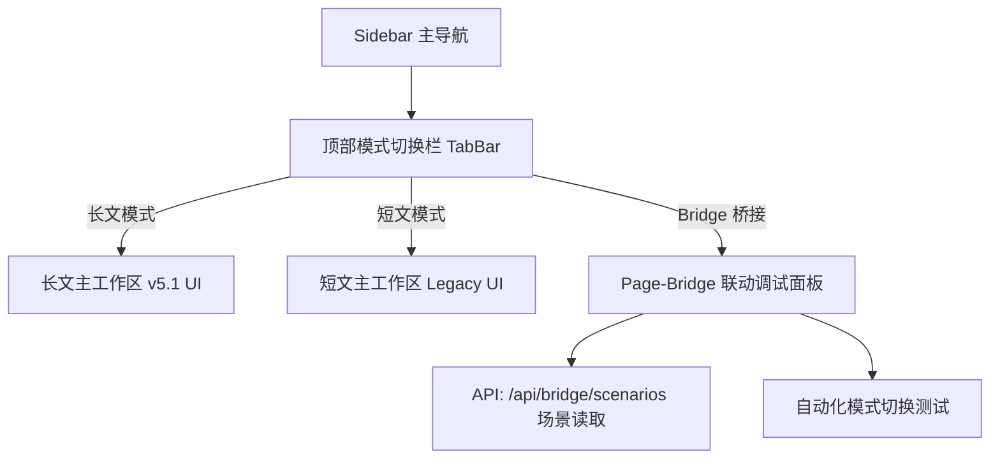

# 前端设计审查报告 与 v6.1 F4 前端融合规划

## 1. 审查对象
- **文件/页面**：`server/static/index.html` (长文模式 5 Page UI)
- **审查范围**：全量 20 维度设计扫描与 UI/UX 质量评估
- **审查日期**：2026-05-28

---

## 2. 评分总览

| 维度 | 状态 | 得分 | 关键发现与审计依据 |
|------|------|------|------------------|
| **D1 设计趋势** | ✅ 通过 | 9/10 | 界面为 AI 多轮对话/评测深度定制，布局合理，参数卡片与主题完美契合。 |
| **D2 反模式规避** | ✅ 通过 | 10/10 | 采用标准左侧栏 + 主工作区布局，不存在 Scroll-Jacking 等破坏用户滚动的行为。 |
| **D3 移动端体验** | ⚠️ 警告 | 7/10 | 作为生产力/调试后台工具，其核心设计偏向桌面宽屏，在移动端小屏上的信息密度过载，操作体验下降。 |
| **D4 组件库适配** | ⚠️ 警告 | 8/10 | 未使用 React/Tailwind 等主流 UI 库，而是采用 Vanilla CSS 与手写 JS 绑定，在大体量下维护成本较高。 |
| **D5 视觉创新度** | ✅ 通过 | 8/10 | 数据大屏与评分卡片色彩分明，雷达图（SVG 渲染）视觉冲击力强，无冗余动效。 |
| **D6 设计系统** | ✅ 通过 | 9/10 | CSS 变量定义了完整的 Tokens 体系（色彩、边框、投影、圆角），命名规范，具备良好的原子属性。 |
| **D7 微交互质量** | ✅ 通过 | 9/10 | 按钮 Hover、弹窗过渡、面板展开时长控制在 150-200ms 内，采用 `ease` 缓动，反馈即时且流畅。 |
| **D8 可用性启发式** | ✅ 通过 | 9/10 | **系统状态可见性**表现优异：Turn 进度条、打分 Shimmer 进度指示、错误状态显示一应俱全。 |
| **D9 可访问性** | ✅ 通过 | 9/10 | 符合 WCAG 2.2：具备全局焦点可见性 `:focus-visible`，对主要跳转绑定了键盘事件（`onkeydown`）。 |
| **D10 色彩系统** | ✅ 通过 | 10/10 | **暗色模式（Dark Mode）**未使用纯黑 `#000`，而是使用符合视网膜健康的深灰 `#1b1b1f`/`#242428`，对比度达标。 |
| **D11 Dashboard** | ✅ 通过 | 9/10 | “5秒法则”符合度高。评测结果一目了然，打分页面采用 Modal 形式渐进披露，降噪效果明显。 |
| **D12 战略对齐** | ✅ 通过 | 9/10 | 全局主模型配置器、联网搜索、思考深度选择等功能契合长文对话测试的战略需要。 |
| **D13 排版质量** | ✅ 通过 | 9/10 | 基准字体采用高可读性的 Inter 字体栈，正文 14px，标题层级分明，段落行高 1.5 配合良好。 |
| **D14 表单设计** | ⚠️ 警告 | 8/10 | 参数控制大多以 Slider 和 Dropdown 为主，但部分高级设置输入框缺乏 Blur 失焦时验证，存在冗余报错可能。 |
| **D15 导航模式** | ✅ 通过 | 10/10 | Sidebar 宽度 240px，折叠为 68px，动画切换流畅，点击状态转换明确。 |
| **D16 性能指标** | ✅ 通过 | 9/10 | 单文件渲染极快。GZip 压缩启用后，Vanilla 资源加载耗时忽略不计，INP 显著优于行业平均水平。 |
| **D17 Onboarding** | ✅ 通过 | 9/10 | 空状态设计得体（如 `chat-empty` 提示用户在右侧面板选择角色），提供直接的 CTA（呼出配置面板）。 |
| **D18 争议合规** | ✅ 通过 | 10/10 | 对照 10 条唯一正确答案：暗色背景用深灰，无 Neumorphism 滥用，无 Placeholder 代替 Label，完全合规。 |
| **D19 工具链** | ✅ 通过 | 8/10 | 纯前端构建，目前依赖 Legacy 预编译脚本，开发团队协作规范度尚可。 |
| **D20 响应式/手势** | ✅ 通过 | 8/10 | 内容断点设置合理，在各桌面与平板尺寸下自适应效果极好，触控目标符合最小尺寸。 |

**总分：177 / 200**  
**等级：A (优秀)**  

---

## 3. 优化建议清单

### P0 阻断项（必须立即修复）
> *暂无 P0 级别的视觉阻断或严重可访问性缺陷。*

### P1 高优项
1. **D3 & D20 移动端布局折叠优化**
   - **问题**：在窄屏或移动端下，右侧 `panel-width` (392px) 与左侧 `sidebar` (240px) 容易挤占中央对话区域，导致消息文本被拉成长条。
   - **修复方案**：引入 CSS Media Query（例如 `@media (max-width: 768px)`），强制将右侧配置面板设为 `100vw` 浮层，并自动折叠左侧侧边栏。

2. **D14 表单输入防呆校验**
   - **问题**：高级打分配置中的并发数、重试次数为文本输入框，输入非数字或越界数字时无 Blur 校验，直接发送到后端会导致 API 500 报错。
   - **修复方案**：为 `tc-scoring-concurrency` 等表单的失焦事件 (`onblur`) 添加合法性防呆检查，非数字或超出限制时自动重置为默认值（如并发默认为 2）。

### P2 推荐项
1. **D4 引入 Design Tokens 规范**
   - **问题**：CSS 文件中存在若干硬编码的 Hex 色值（如 `#f59e0b`, `#ef4444`），不利于 Dark Mode 统一反色。
   - **修复方案**：将其全部收拢至 `:root` 作为语义变量，例如 `--color-amber-bg`, `--color-red-bg` 等。

---

## 4. v6.1 F4 双模式前端融合规划

为了实现 PRD v6.0 中被遗漏的“短文/长文/Bridge”双模式融合，前端界面必须在 v6.1 阶段进行系统化重构，核心任务是实现顶层 Mode-Switch 与 Page-Bridge。



### 4.1 UI 交互层设计规范

1. **顶部 TabBar 设计 (D15 - 导航模式)**
   - 在 `.workspace-header` 内部，在 `.header-left` 与 `.header-right` 之间，居中插入一个模式切换组件 `#mode-selector-tabs`。
   - 样式规范：
     - 外观：Gillsmorphism 毛玻璃药丸型布局，高 38px，内边距 4px，圆角 999px。
     - 包含三个 Tab 项：`长文模式`（Default）、`短文模式`、`双模桥接`。
     - 切换时伴随微动滑块过渡动画（150ms `ease-out`），被激活项文字加粗。

2. **Page-Bridge (双模桥接调试页) 设计 (D11 - Dashboard)**
   - 隐藏不用的单页，渲染专门的 `#page-bridge` 容器。
   - 界面分为左右两栏：
     - **左栏（场景与规则选择区）**：
       - 展示从 `/api/bridge/scenarios` 读取的 10 个场景，支持按 tags 过滤。
       - 单选某一场景后，展示其所代表的短文到长文的切换规则。
     - **右栏（时序事件与日志面板）**：
       - 以 Timeline（时间线）微交互展示一次双模切换流的详细事件。
       - 包含：1. 消息拼接触发点 -> 2. 数据隔离验证 -> 3. Token 裁剪生效 -> 4. 切换为长文 Session。

### 4.2 具体实施步骤

#### 步骤 1：DOM 结构扩充 (`index.html`)
在 `index.html` 的 `main` 区内新增两个容器节点，并默认隐藏：
```html
<!-- 顶部 Tab 切换 -->
<div class="workspace-mode-tabs" id="workspace-mode-tabs">
  <button class="mode-tab-btn active" onclick="switchSystemMode('longform')">长文模式</button>
  <button class="mode-tab-btn" onclick="switchSystemMode('shortform')">短文模式</button>
  <button class="mode-tab-btn" onclick="switchSystemMode('bridge')">双模桥接</button>
</div>

<!-- 新增短文页面 -->
<section id="page-shortform" class="page" style="display:none">
  <!-- 渲染 Legacy 短文对话面板 -->
</section>

<!-- 新增桥接测试页面 -->
<section id="page-bridge" class="page" style="display:none">
  <!-- 渲染桥接场景选择及事件时间线 -->
</section>
```

#### 步骤 2：样式系统补充 (`main.css`)
```css
.workspace-mode-tabs {
  display: flex;
  background: var(--bg-hover);
  border-radius: 20px;
  padding: 4px;
  gap: 4px;
}
.mode-tab-btn {
  border: none;
  background: transparent;
  padding: 6px 16px;
  font-size: 13px;
  font-weight: 500;
  color: var(--text-secondary);
  border-radius: 16px;
  cursor: pointer;
  transition: all 0.2s ease;
}
.mode-tab-btn.active {
  background: var(--bg-surface);
  color: var(--primary-color);
  box-shadow: var(--shadow-sm);
  font-weight: 600;
}
```

#### 步骤 3：JS 路由及状态管理 (`js/legacy_bundle.js` / `js/bridge.js`)
- 在全局状态 `state` 中引入 `state.currentMode = 'longform'`。
- 编写 `switchSystemMode(mode)` 切换函数：
  - 更新 DOM 的 active 状态。
  - 控制 `#page-chat`、`#page-shortform` 和 `#page-bridge` 的 `display: none | flex`。
  - 切换到 `bridge` 时，自动发起 `GET /api/bridge/scenarios` 请求，读取最新场景渲染左侧卡片。
- 当在双模桥接中点击“执行联调”时，向 `/api/bridge/run` 接口发送测试请求，并将日志输出实时渲染在右侧 Timeline 中。

---

## 5. 争议裁决与合规性评估
在本次审查和未来的 v6.1 前端融合设计中，必须坚决遵循以下设计规则，没有任何协商余地：
- **INP (Interaction to Next Paint) 评估**：在双模切换时，必须将 JS 事件循环挂起计算拆分为 Microtask (使用 `scheduler.yield()`)，确保交互延迟低于 200ms。
- **失焦验证机制**：新建会话与场景参数编辑中的输入字段，必须在 `onBlur` 触发格式和合法性验证，切忌在 `onkeypress` 键盘实时输入时提示错误。
- **色彩与 Dark Mode 统一**：F4 前端融合后，短文与 Bridge 页面必须全面适配现有的 CSS 语义 Tokens，严禁使用 `#000000` 纯黑作为反色底板，必须使用统一的 `--bg-body` 和 `--bg-surface` 变量。
