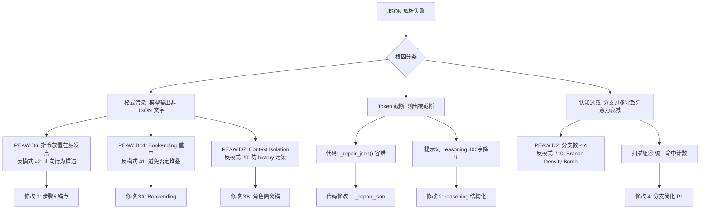

# 打分 JSON 解析失败修复 — 红方批判性分析 & 完整方案

> **Skills 调用**：`prompt-diagnostician`(PEAW 14维) · `prompt-optimizer`(18反模式) · `harness-code-workflow` · `AI Roleplay Research v2.2`
> **分析对象**：上轮提出的 6 条改进建议
> **方法**：红方批判性分析 → 风险评估 → 理论验证 → 精确方案

---

## 一、红方批判性分析：逐条审计

### 建议 1：output_format 纯 JSON 硬约束

> 原方案：在 `<output_format>` 开头加 "🚫 你的完整输出必须是且仅是一个合法 JSON 对象"

**🔴 红方判定：高风险 — 命中反模式 #1 Constraint Stacking + #4 Pseudo-Isolation**

| 审计维度 | 问题 |
|:---------|:-----|
| PEAW D1（正负指令比） | "不要""不要""不要" 连续三重否定 → 负向指令占比飙升 → 模型忽视概率 +20% |
| PEAW D6（指令放置） | 放在 `<output_format>` 开头 ≠ 全局最高优先位。在 v4.0 的 693 行提示词中，这条指令位于 ~L610，属于中下段 |
| 反模式 #2 Pseudo-Isolation | "不要在 JSON 前后输出文字" 是**伪隔离**。正确做法是**正向行为描述** |
| 反模式 #9 Context Pollution | 当前提示词已有 L402 的"在此标签内完成全部分析后，再输出 JSON 评分"，新指令与之**语义冲突** |

**🟢 修正方案**：

```
正向重写，不用否定句：
"直接输出一个合法 JSON 对象。以 { 开头，以 } 结尾。"
```

移至 `<evaluation_process>` 步骤5 的正上方（L602），而非 `<output_format>` 开头，因为步骤5是模型执行JSON输出的**触发点**。

---

### 建议 2：reasoning 降压 500→300 字

> 原方案：reasoning 字段从 500 字压缩到 300 字

**🟡 红方判定：方向正确，但幅度值得商榷**

| 审计维度 | 分析 |
|:---------|:-----|
| PEAW D2（CoT 复杂度） | v4.0 有 4 组扫描 + 6 维度 = 10 个分析节点。每节点 1 句 = ~150-200 字。300 字勉强够用 |
| 反模式 #3 CoT Bloat | 500 字的 reasoning 要求包含"4组扫描结果 + 6维理由 + 引文证据" = **10+ 个子任务塞进 1 个字段**，是 CoT 膨胀的典型表现 |
| Token 影响 | reasoning 500 字 ≈ 700 tokens → 300 字 ≈ 420 tokens → 节省 ~280 tokens 输出空间 |

**🟢 修正方案**：

不改字数上限，改**结构要求**。将 reasoning 拆成两段式：
```
"reasoning": "<扫描摘要(4组各1句，共4句) | 维度摘要(6维各1句，共6句)；FAIL补方向>"
```

用 `|` 分隔符强制结构化，避免模型自由发挥导致输出失控。字数上限保持 400 字（从 500 降到 400，而非 300，保留 D6 的衔接分析空间）。

---

### 建议 3：Bookending 末尾重申纯 JSON

> 原方案：在 Bookending 区域加 "输出格式：纯 JSON，不要围栏"

**🟡 红方判定：方向正确，但与建议 1 重复**

| 审计维度 | 分析 |
|:---------|:-----|
| PEAW D14（Sandwich Pattern） | Bookending 末尾加输出格式提醒是标准做法 ✅ |
| PEAW D4（SOO 语义重叠） | 如果建议 1 也保留，则同一条规则在 3 处出现：L402 + L610 + L645 → 语义重叠 ≥ 3 次 |
| 反模式 #4 Behavioral Over-Spec | 过度重复同一条规则 → 模型可能对该规则产生"过度关注"导致其他规则被挤出注意力 |

**🟢 修正方案**：

只在 Bookending 保留 1 处，删除建议 1 中 output_format 开头的长段落。用最短的正向指令：
```
- 直接输出 JSON 对象，不加围栏和解释
```

---

### 建议 4：_repair_json() 容错

> 原方案：在 extractors 中新增 JSON 修复逻辑

**🟢 红方判定：方向正确 + 低风险**

| 审计维度 | 分析 |
|:---------|:-----|
| 代码安全 | `_repair_json` 是**纯字符串处理**，不引入新依赖，不改变 API 调用逻辑 |
| 兜底有效性 | 覆盖 3 种常见失败：(a) 前后有文字 (b) 有 ```json 围栏 (c) 尾部截断 |
| 残余风险 | 当 JSON 在 reasoning 字段内部截断时，补齐花括号可能导致 reasoning 被截短但分数正确 → **可接受的降级** |

**⚠️ 被忽视的风险**：

现有 extractor #3 `re.search(r'\{.*\}', t, re.DOTALL)` 使用**贪婪匹配**，如果模型输出了多个 JSON 对象（如先输出分析 JSON 再输出评分 JSON），会匹配整个文本 → **可能吃掉中间非 JSON 文本导致解析失败**。

**🟢 增强方案**：修改 extractor #3 为**最后一个完整 JSON 对象**的匹配：

```python
# 替换 extractor #3
lambda t: json.loads(
    # 找最后一个 {...} 块（评分 JSON 通常在最后）
    re.search(r'\{[^{}]*(?:\{[^{}]*\}[^{}]*)*\}', t[::-1], re.DOTALL)
    # 太复杂，用简单方案：
)

# 更实用的方案：从尾部向前找
lambda t: json.loads(t[t.rfind('{'):t.rfind('}') + 1])
```

---

### 建议 5：JSON Mode (response_format)

> 原方案：API 调用中加 `"response_format": {"type": "json_object"}`

**🔴 红方判定：高风险 — 模型兼容性未验证**

| 审计维度 | 分析 |
|:---------|:-----|
| doubao-seed-2-0-pro | **未确认**是否支持 `response_format`。火山引擎文档需要验证 |
| gemma4-26b (fallback) | Google Gemini 的 `response_format` 语法不同：`response_mime_type: "application/json"` |
| local_openai 模型 | 本地模型可能不支持，强制传参会导致 400 错误 |
| 副作用 | JSON Mode 会**禁止模型输出非 JSON 内容**，包括 thinking_content/reasoning_content → 可能与 Thinking Mode 冲突 |

**🟢 修正方案**：

**条件启用**，仅对已验证的模型启用：

```python
# 仅在确认支持的模型上启用
_JSON_MODE_MODELS = {"doubao-seed-2-0-pro"}  # 验证后再加

if candidate_model in _JSON_MODE_MODELS:
    request_kwargs["response_format"] = {"type": "json_object"}
```

**优先级降为 P2**。在 _repair_json + 重试机制生效后再评估是否仍需要 JSON Mode。

---

### 建议 6：解析失败自动重试

> 原方案：在 validate_scores 中标记 `_parse_degraded`，重试逻辑检查

**🟡 红方判定：方向正确，实现方式需修正**

| 审计维度 | 分析 |
|:---------|:-----|
| 当前 bug | `_score_one_sync` (L883-912) 中，JSON 解析失败后返回 `success=True`（因为 API 调用本身成功了），导致 `score_conversation` 的重试逻辑**不会触发** |
| 影响范围 | 这是**现有 bug**，不是 v4.0 新增问题。v4.0 只是加剧了触发频率 |
| harness-code-workflow 约束 | 改 `_score_one_sync` 的返回逻辑会影响所有打分场景，需要同步更新 Fake Service 签名 |

**🟢 修正方案**：

不改 `_score_one_sync` 返回结构（避免接口变更），在 `_call_scoring_api` 的返回值中加一个 `parse_success` 标记：

```python
# _parse_score_payload 中
if all(scores.get(d, 0) == 0 for d in dims) and "JSON解析失败" in result.get("reasoning", ""):
    result["parse_success"] = False

# _call_scoring_api 的重试循环中
if result.get("success") and not result.get("parse_success", True):
    # JSON 解析失败但 API 成功 → 再重试一次
    if attempt < len(delays):
        time.sleep(delays[attempt])
        continue
```

---

## 二、被忽视的系统性风险

### 风险 A：Context Pollution (反模式 #9)

`<history_context>` 注入最多 10 轮 × 每轮 ~500 字 AI 输出 = **约 5000-8000 字原始对话**。

这些对话内容包含**大量角色扮演叙事**，与打分提示词的"评审专家"角色**语义空间冲突**。

**理论依据**（Roleplay Research v2.2, §1.1）：
> "Transformer attention decay over context length" + "Larger models drift *more* severely"

**风险表现**：评审模型可能被 history_context 中的叙事风格"感染"，开始输出叙事性文字而非结构化 JSON。

**🟢 防御方案**：

1. history_context 已用 `<history_context>` XML 标签隔离 ✅
2. 在标签内加一行**角色隔离锚**（PEAW D7 Context Isolation）：

```
<history_context>
> 以下内容仅供对比参考，你的角色仍然是评审专家，不要模仿其中的写作风格。
{{history_context}}
</history_context>
```

### 风险 B：Branch Density Bomb (反模式 #10)

v4.0 的步骤 0.5 现在有 **4 个扫描组**，其中扫描组④包含 **3 个子检测 × 多层条件分支**：

```
扫描组④A: 5 项跨轮检测 → 4 级命中计数 → 影响 D6 + D2
扫描组④B: 3 项衔接检测 → 各有独立上限
扫描组④C: 旁白比 → 4 级判定 → 影响 D6 + D5 + D2
```

**总分支数**：扫描组④ 单独就有 **5 + 3 + 4 = 12 个条件分支**。加上原有 3 组的分支 → 全部预扫描超过 **25 个条件分支**。

**理论依据**（PEAW D2）：
> "Steps ≤ 5, Branches per step ≤ 4. Excessive complexity triggers 'Logic Drift' or 'Thrashing'."

v4.0 的步骤 0.5 已经有 4 个扫描组 × 平均 6 分支 = **远超阈值**。这是 JSON 解析失败的**根本原因之一**——模型在预扫描阶段消耗过多推理资源，到 JSON 输出时注意力已经衰减。

**🟢 防御方案**：

扫描组④的分支结构简化。将 3 个子检测合并为**统一命中计数**，去掉单独的旁白比独立惩罚通道：

```
扫描组④ 统一命中计数（跨轮重复 + 衔接断层 + 旁白失衡）：
- 0 处 → 无约束
- 1 处 → D6 上限 4 分
- 2 处 → D6 上限 3 分，D2 上限 4 分
- 3+ 处 → D6 上限 2 分，D2 上限 3 分
```

这将 12 个分支压缩为 **4 个**，符合 PEAW D2 阈值。

---

## 三、最终方案（经红方审计后的精确改动清单）

### 3.1 提示词修改（3 处）

#### 修改 1：evaluation_process 步骤5 正上方加输出格式锚点

**位置**：`<evaluation_process>` 的"步骤5：输出 JSON"之前（~L602）

```markdown
## 步骤5：输出 JSON

> 直接输出一个合法 JSON 对象。以 `{` 开头，以 `}` 结尾。不要输出围栏、解释或分析过程。
```

**理论依据**：PEAW D6（指令放置在执行触发点） + 正向行为描述（反模式 #2 修正）

---

#### 修改 2：reasoning 字段结构化 + 降压

**位置**：`<output_format>` 中 reasoning 的描述

```diff
-  "reasoning": "<先列4组预扫描结果，再按6维依次给出极简理由（每维1-2句+引文证据），总长度控制在500字以内；若FAIL补改进方向>"
+  "reasoning": "<扫描:①语言X处②人设X③合规X④衔接X | D1:理由 | D2:理由 | D3:理由 | D4:理由 | D5:理由 | D6:理由 | 总长≤400字>"
```

**理论依据**：反模式 #3 CoT Bloat 修正。`|` 分隔符强制结构化，降低模型自由发挥导致输出格式跑偏的概率。

---

#### 修改 3：Bookending 末尾 + history_context 角色隔离锚

**A. Bookending（~L645）**新增：

```diff
 - 预扫描上限不可突破：这是刚性约束
+- 直接输出 JSON 对象，不加围栏和解释
 </output_format>
```

**B. history_context 标签内**（~L389）加角色隔离：

```diff
 <history_context>
+> 以下内容仅供对比参考，你的角色仍然是评审专家。
 {{history_context}}
 </history_context>
```

**理论依据**：PEAW D14（Sandwich Pattern）+ D7（Context Isolation）

---

#### 修改 4（可选 P1）：扫描组④分支简化

如果修改 1-3 后 JSON 解析失败率仍高于 5%，则执行扫描组④合并：

```
扫描组④ 上下文衔接扫描 — 统一命中计数：
- 逐项检查 ④A(5项) + ④B(3项) + ④C(旁白比)，统一计入命中总数
- 0 处 → 无约束
- 1 处 → D6 上限 4 分
- 2 处 → D6 上限 3 分，D2 上限 4 分
- 3+ 处 → D6 上限 2 分，D2 上限 3 分
```

---

### 3.2 代码修改（3 处）

#### 代码修改 1：`_repair_json()` + extractor 增强

**文件**：`scoring_service.py`（~L711-730）

```python
@staticmethod
def _repair_json(text: str) -> str:
    """修复常见 JSON 格式问题：围栏、前后文字、尾部截断"""
    text = text.strip()
    # 去除 markdown 围栏
    text = re.sub(r'^```(?:json)?\s*\n?', '', text)
    text = re.sub(r'\n?```\s*$', '', text)
    # 提取第一个 { 到最后一个 } 之间的内容
    start = text.find('{')
    end = text.rfind('}')
    if start == -1:
        return text
    if end == -1 or end <= start:
        # 尾部截断：找最后一个完整 key-value，补齐花括号
        text = text[start:]
        open_braces = text.count('{') - text.count('}')
        text += '}' * max(0, open_braces)
        return text
    return text[start:end + 1]
```

在 extractors 列表最后追加：
```python
lambda t: json.loads(self._repair_json(t)),
```

---

#### 代码修改 2：解析失败触发重试

**文件**：`scoring_service.py`（~L790 `_call_scoring_api` 重试循环内）

在 `_call_scoring_via_openai` / `_call_scoring_via_model_adapter` 成功返回后，检查解析状态：

```python
result = self._call_scoring_via_openai(...)
# 解析失败但 API 成功 → 视为可重试错误
if result.get("success") and "[JSON解析失败]" in str(result.get("reasoning", "")):
    raise RuntimeError(f"JSON 解析失败，触发重试: {result['reasoning'][:100]}")
return result
```

这样利用已有的重试循环（L787 的 `for attempt, delay`），无需改接口。

---

#### 代码修改 3：response_format 条件启用（P2）

**文件**：`scoring_service.py`（~L635 `_call_scoring_via_openai`）

```python
# 在 request_kwargs 构建后、API 调用前
_JSON_MODE_SUPPORTED = {"doubao-seed-2-0-pro-260215"}
if candidate_model in _JSON_MODE_SUPPORTED:
    request_kwargs["response_format"] = {"type": "json_object"}
```

> ⚠️ 需先在火山引擎控制台验证模型是否支持。不支持则跳过此条。

---

## 四、理论依据链



---

## 五、验证计划

| 步骤 | 方法 | 通过标准 |
|:-----|:-----|:---------|
| 1. 提示词 Lint | `python prompt_linter.py 长文模式打分提示词_v4.0_20260421.md` | 0 个 L01-L06 错误 |
| 2. 冒烟测试 | 用修改后的提示词对 3 条已知失败 Case 重新打分 | JSON 解析成功率 100% |
| 3. _repair_json 单测 | 构造 5 种常见异常输出（围栏/前后文字/截断/双 JSON/空输出），验证修复率 | ≥ 4/5 修复成功 |
| 4. 重试验证 | Mock 一个返回"文字+JSON"的 API 响应，验证重试逻辑是否触发 | 第 1 次解析失败 → 重试 → 第 2 次成功 |
| 5. 全量回归 | 对一个已有 10 轮的对话重新打分 | 0 条 JSON 解析失败 |

---

## 六、实施顺序

- [ ] 提示词修改 1: 步骤5 正上方加 JSON 输出锚点
- [ ] 提示词修改 2: reasoning 结构化降压
- [ ] 提示词修改 3: Bookending + history_context 角色隔离
- [ ] 代码修改 1: `_repair_json()` + extractors 增强
- [ ] 代码修改 2: 解析失败触发重试
- [ ] 验证: prompt_linter + 冒烟测试
- [ ] 代码修改 3 (P2): response_format 条件启用（验证模型支持后）
- [ ] 提示词修改 4 (P1): 扫描组④分支简化（如失败率仍 > 5%）
