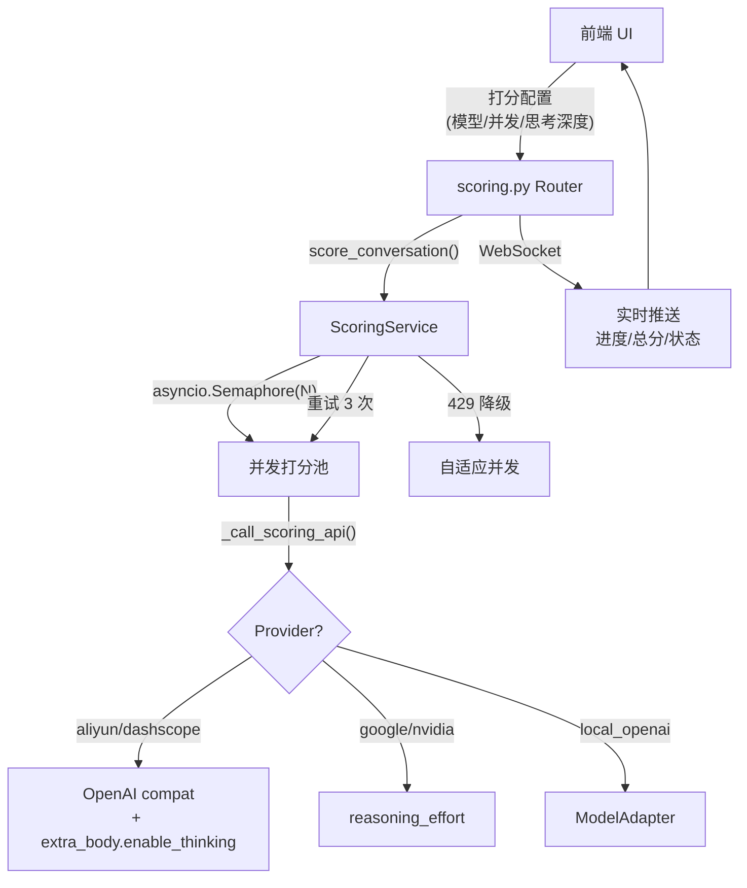

# 打分管道工业化重构 — 实施计划

## 目标

将打分管道从「串行 + 无重试 + 硬编码模型」升级为「并发可调 + 自动重试 + DashScope 思考深度 + 实时刷新」的全局通用架构。

## 需求决策汇总

| # | 决策 | 用户选择 |
|---|------|---------|
| Q1 | 并发方式 | B — 前端可调，后端统一线程池，上限 20+ |
| Q2 | 重试策略 | B — 固定 3 次(5/15/30s)，UI 显示重试状态 |
| Q3 | 思考深度 | DashScope `extra_body={"enable_thinking":True, "thinking_budget":N}` |
| Q4 | 打分提示词 | A — 所有对比模型共用同一版本 |
| Q5 | 并发范围 | C — 生成+打分都要 |
| Q6 | 失败重试 | C — 自动重试 N 次，全失败标红手动重试 |
| Q7 | 平均分 | 只算已出分轮次 |
| Q8 | 总分刷新 | C — 每轮重打分后自动重算+推送 |
| Q9 | 切换模型 | A — 全量重打 |
| Q10 | 主模型展示 | A — 逗号分隔所有勾选模型 |
| Q11 | 默认打分模型 | A — 全局 qwen3.6-plus |
| Q12 | 控制面板位置 | A — 测试中心 → 高级设置 |
| Q13 | 模型列表 | A — 共用 models.yaml |
| Q14 | 刷新范围 | ABC — 弹窗+历史表格+侧栏 |
| Q15 | 刷新方式 | A — WebSocket 推送 |
| Q16 | 无 ai_output | 跳过 |
| Q17 | 429 处理 | B — 自动降低并发 |
| Q18 | 打分队列 | 共享一个 |
| Q19 | 分阶段 | 一次全做 |
| Q20 | 适用范围 | 全局通用 |
| Q21 | 选择器 | 两个独立（对话模型 / 打分模型） |
| Q22 | 历史重打分 | 用当前最新打分模型配置 |

---

## 架构概览



---

## 变更清单

### Phase 1：后端核心 — DashScope 思考深度 + 并发 + 重试

---

#### [MODIFY] [scoring_service.py](file:///e:/提效工具/长文模式生成/server/services/scoring_service.py)

**1.1 DashScope `enable_thinking` + `thinking_budget` 支持**

当前 `_call_scoring_via_openai()` (L549-556) 只对 Google/Nvidia 传 `reasoning_effort`。需增加 DashScope 分支：

```python
# L549-556 改为：
provider = self._resolve_scoring_provider(model_alias)
if thinking_effort and thinking_effort != "disabled" and self._model_supports_thinking(model_alias):
    if provider in {"google", "google_gemini", "nvidia"}:
        request_kwargs["reasoning_effort"] = thinking_effort
    elif provider in {"aliyun", "dashscope", "volcengine", ""}:
        # DashScope OpenAI 兼容接口：通过 extra_body 传入
        extra_body = {"enable_thinking": True}
        # thinking_budget 映射：low=256, medium=1024, high=4096
        budget_map = {"low": 256, "medium": 1024, "high": 4096}
        if thinking_effort in budget_map:
            extra_body["thinking_budget"] = budget_map[thinking_effort]
        request_kwargs["extra_body"] = extra_body
```

解析响应时也需提取 `reasoning_content`（L560）：

```python
raw = response.choices[0].message.content or ""
# 新增：提取 reasoning_content（DashScope 返回）
reasoning_raw = getattr(response.choices[0].message, "reasoning_content", "") or ""
```

**1.2 `score_conversation()` 从串行改为并发**

当前 L875 是 `for index, result in enumerate(results)` 串行循环。改为 `asyncio.Semaphore` 控制并发：

```python
async def score_conversation(
    self, conv_id, results, config, on_progress=None,
    max_workers: int | None = None,  # 新增参数
):
    semaphore = asyncio.Semaphore(max_workers or self._max_workers)
    
    async def _score_one(index, result):
        async with semaphore:
            # ... 现有单轮打分逻辑
            return {"turn": turn_number, **score_result}
    
    tasks = [_score_one(i, r) for i, r in enumerate(results)]
    scored = await asyncio.gather(*tasks)
    return list(scored)
```

**1.3 自动重试失败轮次**

在 `score_conversation()` 内部，单轮打分失败后自动重试（最多 3 次）：

```python
async def _score_one_with_retry(index, result, max_retries=3):
    for attempt in range(1, max_retries + 1):
        score_result = await self.score_turn(turn_data, ...)
        if score_result.get("success"):
            return score_result
        if attempt < max_retries:
            await asyncio.sleep(self._default_retry_delays[attempt - 1] if attempt <= len(self._default_retry_delays) else 30)
            await on_progress({"type": "retry", "turn": turn_number, "attempt": attempt, "max_retries": max_retries})
    return score_result  # 最后一次结果（失败）
```

**1.4 429 自适应降级**

在 `_call_scoring_api()` 重试循环中检测 429：

```python
except Exception as exc:
    if "429" in str(exc) or "rate_limit" in str(exc).lower():
        # 动态收缩 semaphore（通过回调通知上层）
        self._on_rate_limit(candidate["alias"])
```

新增 `_adaptive_concurrency` 属性和 `_on_rate_limit()` 方法，检测到 429 时将 semaphore 值减半（最低 1）。

**1.5 动态修改 max_workers**

```python
def set_max_workers(self, n: int):
    self._max_workers = max(1, min(n, 24))
    self._executor = ThreadPoolExecutor(max_workers=self._max_workers)

def get_max_workers(self) -> int:
    return self._max_workers
```

---

#### [MODIFY] [scoring.py (router)](file:///e:/提效工具/长文模式生成/server/routers/scoring.py)

**1.6 新增打分配置 API**

```python
@router.post("/config")
async def update_scoring_config(data: ScoringConfigUpdate):
    """更新打分配置（并发数/模型/思考深度）"""
    service = _get_scoring()
    if data.max_workers is not None:
        service.set_max_workers(data.max_workers)
    return {"max_workers": service.get_max_workers()}
```

**1.7 `trigger_scoring` 传递并发数和打分模型**

修改 `trigger_scoring()` (L631)，从请求体读取 `max_workers`、`scoring_model_id`、`scoring_thinking_effort` 等参数，覆盖 config.runtime 后传入 `_run_scoring()`。

**1.8 单轮重打分后自动刷新总分+WebSocket推送**

修改 `trigger_single_turn_scoring()` (L659)，打分成功后：

```python
# 重算整个对话的平均分
refreshed_conv = _get_visible_conversation_or_404(conv_id)
results = refreshed_conv.get("results", [])
scored = [r for r in results if r.get("score_status") == "scored"]
avg_total = round(sum(r.get("score_total", 0) for r in scored) / len(scored), 2) if scored else 0

# WebSocket 推送刷新事件
await _push_score_message(conv_id, {
    "type": "score_updated",
    "turn": turn,
    "avg_total": avg_total,
    "scored_count": len(scored),
    "total_count": len(results),
})
```

**1.9 一键重打分 API（切换模型后）**

```python
@router.post("/{conv_id}/rescore-all")
async def rescore_all(conv_id: str, data: RescoreAllRequest):
    """切换打分模型后全量重打"""
    # 1. 清空所有旧分数
    for result in results:
        db.update_turn_scores(conv_id, result["turn"], {
            "persona_fidelity": 0, ..., "mapped_total": 0,
            "reasoning": "", "success": False,
        })
    # 2. 用新模型重新打分
    config["runtime"]["scoring_model_id"] = data.scoring_model_id
    config["runtime"]["scoring_thinking_effort"] = data.scoring_thinking_effort
    asyncio.create_task(_run_scoring(conv_id, results, config, service))
```

---

#### [MODIFY] [config.py](file:///e:/提效工具/长文模式生成/server/config.py)

**1.10 默认打分模型改为 qwen3.6-plus**

```python
DEFAULT_SCORING_MODEL_ID = os.environ.get("DEFAULT_SCORING_MODEL_ID", "qwen3.6-plus")
```

---

### Phase 2：前端 — 打分控制面板 + 实时刷新

---

#### [MODIFY] [index.html](file:///e:/提效工具/长文模式生成/server/static/index.html)

**2.1 高级设置区域增加打分控制面板**

在测试中心的高级设置区域内，新增一组控件：

```html
<fieldset class="scoring-config-panel">
  <legend>🎯 打分配置</legend>
  <div class="form-row">
    <label>打分模型</label>
    <select id="f-scoring-model"><!-- 动态填充 models.yaml --></select>
  </div>
  <div class="form-row">
    <label>思考深度</label>
    <select id="f-scoring-thinking-effort">
      <option value="disabled">关闭</option>
      <option value="low">低 (256 tokens)</option>
      <option value="medium">中 (1024 tokens)</option>
      <option value="high" selected>高 (4096 tokens)</option>
    </select>
  </div>
  <div class="form-row">
    <label>打分并发</label>
    <input type="range" id="f-scoring-concurrency" min="1" max="24" value="6">
    <span id="scoring-concurrency-display">6</span>
  </div>
  <div class="form-row">
    <label>失败自动重试</label>
    <select id="f-scoring-retry">
      <option value="3" selected>3 次</option>
      <option value="5">5 次</option>
      <option value="0">不重试</option>
    </select>
  </div>
</fieldset>
```

> 注意：`f-scoring-model` 已经在 `legacy_bundle.js` 中有引用（L1937），这里是将其从隐藏位置移到高级设置中统一展示。

---

#### [MODIFY] [legacy_bundle.js](file:///e:/提效工具/长文模式生成/server/static/js/legacy_bundle.js)

**2.2 修改默认打分模型常量**

```diff
-const DEFAULT_SCORING_MODEL_ID = 'gemma4-31b-it';
+const DEFAULT_SCORING_MODEL_ID = 'qwen3.6-plus';
```

**2.3 打分并发控件联动**

```javascript
// 滑块变化时实时更新显示值并同步到后端
$('f-scoring-concurrency')?.addEventListener('input', async (e) => {
  const val = parseInt(e.target.value);
  $('scoring-concurrency-display').textContent = val;
  await fetch('/api/scoring/config', {
    method: 'POST',
    headers: {'Content-Type': 'application/json'},
    body: JSON.stringify({max_workers: val})
  });
});
```

**2.4 WebSocket 接收 `score_updated` 事件刷新 UI**

在现有 WebSocket handler 中增加处理：

```javascript
case 'score_updated':
  // 1. 刷新弹窗内总分和雷达图
  updateScoringModalSummary(data);
  // 2. 刷新历史表格对应行的总分
  updateHistoryRowScore(data.conversation_id, data.avg_total);
  // 3. 刷新侧边栏最近对话列表
  updateSidebarScore(data.conversation_id, data.avg_total);
  break;
case 'retry':
  // 显示重试状态 badge
  showRetryBadge(data.turn, data.attempt, data.max_retries);
  break;
```

**2.5 对比结果表格显示平均分**

在模型对比的结果卡片头部（当前显示 `16 轮 · 435 字` 处），追加平均分：

```javascript
// 在 renderCompareHeader() 中
const avgScore = scoredTurns.length > 0
  ? (scoredTurns.reduce((s, t) => s + t.score_total, 0) / scoredTurns.length).toFixed(1)
  : '--';
html += `<span class="avg-score-badge">${avgScore}分</span>`;
```

**2.6 运行配置展示所有勾选模型**

修改当前显示 `主模型: doubao-character` 的逻辑，改为列出所有勾选的对比模型：

```javascript
const allModels = selectedModels.map(m => m.id).join(', ');
configHtml += `<span>对比模型: <strong>${escapeHtml(allModels)}</strong></span>`;
```

**2.7 切换打分模型后「一键打分」触发全量重打**

```javascript
async function rescoreAll(convId) {
  const scoringModelId = getInputValue('f-scoring-model').trim();
  const thinkingEffort = getInputValue('f-scoring-thinking-effort').trim();
  await fetch(`/api/scoring/${convId}/rescore-all`, {
    method: 'POST',
    headers: {'Content-Type': 'application/json'},
    body: JSON.stringify({
      scoring_model_id: scoringModelId,
      scoring_thinking_effort: thinkingEffort,
    })
  });
}
```

---

### Phase 3：DashScope Provider 适配

---

#### [MODIFY] [model_adapter.py 或相关 provider](file:///e:/提效工具/长文模式生成/server/services/model_adapter.py)

**3.1 确保 provider 字段标记 DashScope 模型**

在 models.yaml 中，qwen 系列模型需标记 `provider: aliyun` 或 `provider: dashscope`，以便 `_call_scoring_via_openai()` 走正确的思考深度分支。

**3.2 解析 reasoning_content 响应**

DashScope 返回的思考过程在 `delta.reasoning_content` 字段。在 `_call_scoring_via_openai()` 中提取并存入 score 结果，用于调试。

---

### Phase 4：数据一致性修复

---

#### [MODIFY] [database.py](file:///e:/提效工具/长文模式生成/server/database.py)

**4.1 新增 `recalculate_conversation_avg()` 方法**

```python
def recalculate_conversation_avg(conv_id: str) -> dict:
    """重算对话平均分，只计入 score_status='scored' 的轮次"""
    conn = get_connection()
    row = conn.execute("""
        SELECT AVG(score_total) as avg_total, COUNT(*) as scored_count
        FROM turn_results
        WHERE conversation_id=? AND score_status='scored'
    """, (conv_id,)).fetchone()
    conn.close()
    return {"avg_total": round(row["avg_total"] or 0, 2), "scored_count": row["scored_count"] or 0}
```

**4.2 历史记录总分修复**

在 `update_turn_scores()` 末尾自动触发总分重算，确保每次单轮打分更新后历史列表的总分准确。

---

## 文件变更汇总

| 文件 | 类型 | 改动要点 |
|------|------|---------|
| `server/services/scoring_service.py` | MODIFY | DashScope thinking / 并发 / 重试 / 429 降级 / set_max_workers |
| `server/routers/scoring.py` | MODIFY | config API / rescore-all / 单轮刷新推送 / 传递 max_workers |
| `server/config.py` | MODIFY | DEFAULT_SCORING_MODEL_ID → qwen3.6-plus |
| `server/database.py` | MODIFY | recalculate_conversation_avg() |
| `server/static/index.html` | MODIFY | 打分控制面板 HTML |
| `server/static/js/legacy_bundle.js` | MODIFY | 默认模型 / 并发控件 / WS 刷新 / 平均分 / 运行配置展示 / 全量重打 |
| `server/routers/compare.py` | MODIFY | 平均分展示增强（已有基础，微调） |

---

## 验证计划

### 自动化测试

```bash
cd e:\提效工具\长文模式生成 && pytest test_v51_regression.py -v
```

### 手动验证

1. **DashScope 思考深度**：选 qwen3.6-plus 打分，确认请求含 `extra_body.enable_thinking`
2. **并发调节**：滑块调到 12，触发 16 轮打分，确认多轮并行执行
3. **失败重试**：Mock 打分 API 前 2 次返回 500，确认第 3 次成功+UI 显示重试状态
4. **429 降级**：模拟 429 响应，确认并发自动减半
5. **总分实时刷新**：单轮重打分后，确认弹窗/历史表格/侧栏分数同步更新
6. **全量重打**：切换打分模型后点一键打分，确认旧分数清空+新模型重新打分
7. **对比页平均分**：确认每个模型卡片显示平均分
8. **运行配置展示**：确认显示所有勾选模型（逗号分隔）

### 浏览器验收

启动服务后通过 browser_subagent 截图验证 UI 改动。
